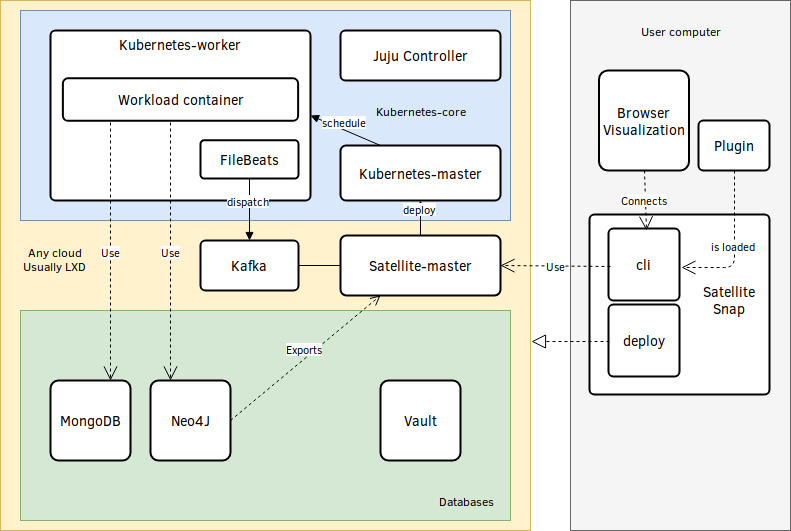

# Satellite

Satellite is a scalable Open Source Intelligence platorm for security researchers who are looking for an easy to use plugin system. Satellite allows you to create in minutes a module that will run on a Kubernetes based cluster and be launchable from a user-friendly Command Line Interactive tool.

This module will have access to a ready to use infrastructure containing MongoDB, Kafka, Neo4J and be run on Kubernetes.

Satellite gives you access to MongoDB for cache data storage and Neo4J for the result graph. The CLI allows you to visualize easily the data stored in Neo4J.



## Install

### Operating System

- Download and install Ubuntu 18.04 LTS
- `snap install satellite`
- `satellite.deploy` and follow instructions (it takes about one hour)

You can monitor units with `juju status` or via the web gui with `juju gui`.

#### Troubleshooting

- `satellite.clean` to remove the deployed infrastructure.

## CLI Usage

```shell
$> satellite.cli --help
Options:
  --help        Show help                                              [boolean]
  --version     Show version number                                    [boolean]
  --server, -s                                            [default: "localhost"]
  --port, -p                                                       [default: 80]
  --protocol                                                   [default: "http"]
```

## Plugin creation

### Setup

- Create a folder
- Create a folder "features" in the first folder

These two steps can be realized either on the same machine as the CLI, either
on the same machine as the satellite Master server.

### CLI Config

- Create a folder "cli" in "yourplugin/features"
- Create a "config.yml" file in "yourplugin/features/cli"

This yaml file has to contain a list of objects. Each object contains 3 attributs:

- configuration: It's the vorpal configuration line
- description: A human readable description of the command
- kubernetes-file: The name of the associated kubernetes deployment file

```yaml
- configuration: test with required option <username>
  description: This is a test command
  kubernetes-file: test.yml

- configuration: another test <username>
  description: another test command
  kubernetes-file: test.yml
```

See vorpal commands for the configuration attribut: https://github.com/dthree/vorpal/wiki/API-%7C-vorpal.command#vorpalcommandcommanddescription

### Kubernetes deployments

- Create a folder "deployments" in "yourplugin/features"
- Create a deployment file "test.yml" in "yourplugin/features/deployments"

This file must contain a Kubernetes deployment configuration. This configuration will be sent to
Kubernetes with "kubectl create -f" and so has to be compatible with such command.

If you need to have params for your configuration, you can use the jinja2 syntax to template the
deployment file. The deployment file will be compiled with Swig (which respects jinja2 syntax).
When you define an argument or an option in the configuration attribut of the CLI config file,
the argument will be sent to the templating engine.

There is templating variables for an uuid generated value and network configurations:

- `uuid`
- `mongodb_host`
- `mongodb_port`
- `neo4j_host`
- `neo4j_post`
- `kafka_host`
- `kafka_port`
- `registry_host`
- `registry_port`

An example of the deployment template file:

```yaml
---
apiVersion: batch/v1
kind: Job
metadata:
  name: spotify-habits-get-all-for-user-{{ username }}
spec:
  template:
    metadata:
      labels:
        app: spotify-habits
    spec:
      containers:
        - name: spotify-habits-get-all-for-user-{{ username }}
          image: spotify-habits
          args: ["./get_all_for_user.sh", "{{ username }}"]
          env:
            - name: NEO4J_URL
              value: "bolt://{{ neo4j_host }}:{{ neo4j_port }}"
      restartPolicy: Never
```

### Load plugin

#### if you want to load it from the CLI

- launch the CLI.
- type `load plugin /path/to/the/plugin`

You can load again to apply modifications of a plugin and so iterate while developing it.

#### if you want to load it from master

- launch master with the option `--loadPluginsDir /path/to/your/plugin`

Reload master to reload the plugin

## Workflow

### Install

Run `snap install satellite`

### Start: Deploy

Run `satellite.deploy`

The master IP will be displayed at the end.
We'll use it as "$ip"

Run `satellite.cli -s $ip`

### Use

Load plugins you want to load with `load plugin ../plugin/testplugin`

You'll have now access to new commands.
Launch some commands, you'll see the progress through grey logs on the CLI.

You have access to a visualizer on http://localhost:9123/ (on the same machine as the CLI)

### Code: CLI

- Install nodejs yarn, https://yarnpkg.com/fr/docs/install
- Go into the `cli` folder
- Launch the `yarn` command
- Launch CLI with `yarn start -s $ip -p $port` (`$ip` is the satellite master ip address and `$port` the port)

### Code: Master

- Install dependencies: `sudo apt install build-essential python librdkafka-dev`
- Install nodejs yarn, https://yarnpkg.com/fr/docs/install
- Go into the `master` folder

To build and redeploy:

- `docker build -t smaster .`
- Get the docker registry ip with `juju status`
- `docker tag smaster ip:5000/smaster`
- `docker push ip:5000/smaster`
- `juju remove-machine <smaster machine id> --force`
- `juju remove-application smaster`
- See the `deploy.sh` script to redeploy the smaster charm

Troubleshoot with:

- `juju ssh smaster/0`
- `sudo docker logs $(docker ps -q)` or `sudo cat /var/log/juju/unit*.log`

### Code: Plugin

- Go into the `plugins` folder
- Code scripts you need, and update the deployment configuration
- `docker build -t <pluginname> .`
- `docker tag <pluginname> ip:5000/<pluginname>`
- `docker push ip:5000/<pluginname>`
- Launch the CLI with `satellite.cli -s $ip -p $port` (`$ip` is the satellite master ip address and `$port` the port)
- Run `load plugin ./`
- Test the plugin commands

### Code: Plugin code

- `juju status`
- cd into plugin directory
- code scripts you need, and give them the IPs they need for MongoDB and Neo4J
- code and iterate by starting them manually
- launch the CLI with `satellite.cli -s $ip`
- run `load plugin ./`

This is the iteration loop

- `docker build -t pluginname .`
- `docker push ip:5000/pluginname`
- exec the plugin commands
- iterate

### Code: Deployment

- `./deploy.sh`
- Check if everything works with juju status
- Try to use it
- Modify deployment code
- `./clean.sh`
- Iterate

### End: Clean

Run `satellite.clean`
